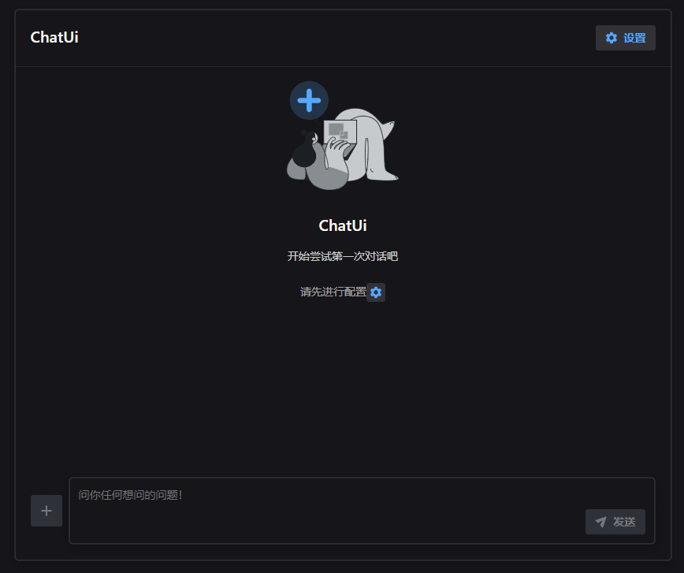
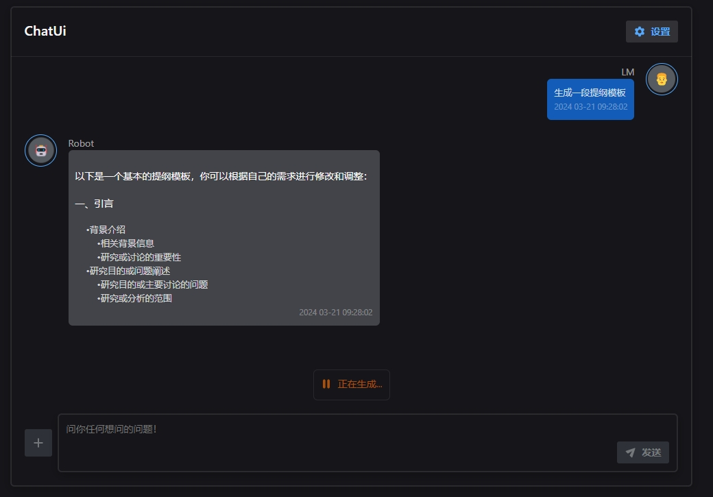

 <h1>Chat-Comp<h1>

文心一言初体验

### ✨ 功能
- [x] 即拿即用，一键配置
- [x] 普通问答
- [x] 代码高亮，支持复制、编辑
- [x] 使用`react-markdown`,易于扩展定制
- [x] 输入提示关键词、`tab`一键补全 

### 🤖 预览

